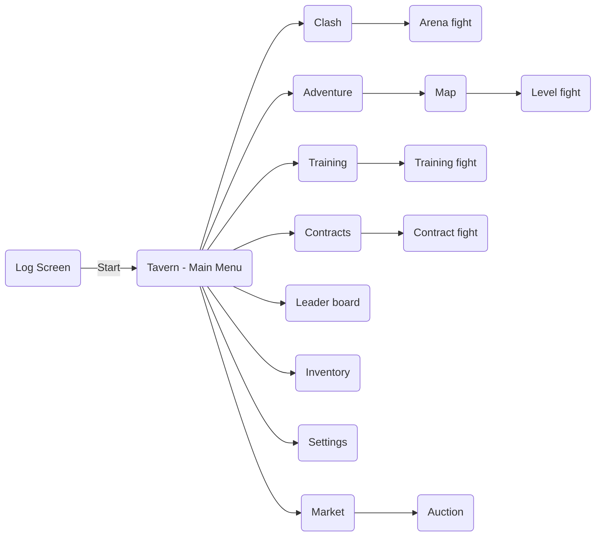

# telegram_first_app
This is the first repository for our projects. It was created primarily to test the collaboration capabilities in GitHub.

# Story line

### Bounty Hunters

You are a Monster Bounty Hunter. You're always looking for a new contract for the next monster. But there are many of you, because in addition to the reward of gold coins, there is always a chance to find **a truly powerful weapon** and, thanks to it, become the best bounty hunter.

Here, in a tavern in the forest, all the monster hunters gathered in anticipation of new contracts and adventure. You can always challenge anyone who looks askance at you. But don’t forget to check the rating board, otherwise there may be nothing left of you.
 
# Basic gaming features

#### PvP with other players (Arena)
##### Mechanics
 - Search opponent
   - Ranked                         ***| Normal chance for item drop + Gold + XP***
   - Normal                         ***| Low chance for item drop + Gold + XP***
 - Rating table                       ***| Rewards for topest position***
 - History of fights

#### PvE against monsters (Adventure)
##### Mechanics
 - Map with levels                      ***| Low chance for item drop + Gold + XP***
   - Repeat any levels for the grind
 - Contracts                          ***| Good chance for item drop + Gold + XP***
 - Training with mannequin (DPS check)  ***| No rewards***

#### Fight
Tap to correct left/right button to hit opponent/enemy
Possible adjacmet:
 - As the enemy's HP decreases, in order to finish you will need to not just tap on the buttons, but to move the button in the right direction
 - As you progress, the higher the level of the enemy, the more directional buttons will appear

The approach here like in Guitar Hero

#### Character
##### Aplificaions
 - The main thing is **a new weapon**
   - Weapon give you stats, damage and *ability*
 - Items e.g. armor, shield, flask ...
 - *Perks*
 - Combo during the battle
##### How to reach
 - XP rewards -> *Each lvl more stats*
 - Gold rewards -> *Buy new items on market*
 - Buy new items for $$$

# Game structure
#### Interface

## Ideas

 - Classes
 - Dungeons
 - What about fun in the game?

## Links
 - https://itch.io/game-assets/free/tag-2d/tag-icons
 - https://www.pixilart.com/draw
 - https://penzilla.itch.io/vector-icon-pack
 - https://babysamurai.itch.io/super-epic-fantasy-weapons-pack
 - https://greatdocbrown.itch.io/gamepad-ui
 - https://penzilla.itch.io/rpg-and-magic-icons
 - https://gandalfhardcore.itch.io/free-pixel-art
 - https://www.youtube.com/watch?v=1pJyYtBAHks

# Open questions

 - Game Graphic Style
   - [ ] Vector - e.g. https://penzilla.itch.io/rpg-and-magic-icons
   - [ ] Pixel - e.g. https://thewisehedgehog.itch.io/hs2020
 - Character
   - [ ] Need to create character
   - [ ] Common for everone
   - [ ] Without
